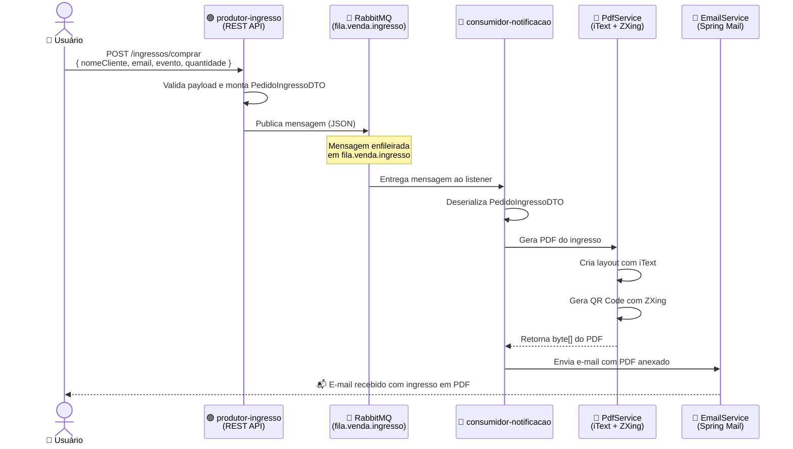
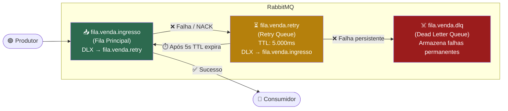

# 🎟️ TicketFlow

> **Sistema de Venda de Ingressos baseado em Eventos (EDA)**
> Arquitetura de Microsserviços com Spring Boot 3 + RabbitMQ + Docker

[](https://openjdk.org/projects/jdk/21/)
[](https://spring.io/projects/spring-boot)
[](https://www.rabbitmq.com/)
[](https://www.docker.com/)

---

## 📋 Sumário

- [Visão Geral](#-visão-geral)
- [Tecnologias](#-tecnologias)
- [Arquitetura e Fluxo de Mensagens](#-arquitetura-e-fluxo-de-mensagens)
- [Estratégia de Resiliência com DLQ](#-estratégia-de-resiliência-com-dlq)
- [Estrutura de Pastas](#-estrutura-de-pastas)
- [⚙️ Configuração do application.properties](#️-configuração-do-applicationproperties)
- [Como Executar](#-como-executar)
- [Endpoint e Payload](#-endpoint-e-payload)
- [Destaques Técnicos](#-destaques-técnicos)
- [RabbitMQ Management](#-rabbitmq-management)

---

## 🔭 Visão Geral

O **TicketFlow** é um sistema de venda de ingressos construído sobre os princípios de **Event-Driven Architecture (EDA)**. Ao invés de comunicação síncrona entre serviços, toda a troca de informações é feita através de mensagens assíncronas via **RabbitMQ**, garantindo desacoplamento total, alta disponibilidade e resiliência a falhas.

O sistema é dividido em dois microsserviços independentes:

| Microsserviço | Responsabilidade |
|---|---|
| `produtor-ingresso` | Expõe a API REST, valida a compra e publica o evento na fila |
| `consumidor-notificacao` | Consome o evento, gera o PDF com QR Code e envia o e-mail ao cliente |

---

## 🛠️ Tecnologias

### Core

| Tecnologia | Versão | Finalidade |
|---|---|---|
| Java | 21 | Linguagem principal (Virtual Threads ready) |
| Spring Boot | 3.3.5 | Framework base dos microsserviços |
| Spring AMQP | 3.x | Integração com RabbitMQ |
| RabbitMQ | 3.x | Message Broker para comunicação assíncrona |
| Docker / Compose | Latest | Orquestração dos containers |

### Bibliotecas Especializadas

| Biblioteca | Finalidade |
|---|---|
| **iText 7** | Geração de PDFs do ingresso |
| **ZXing (Google)** | Geração de QR Code embutido no PDF |
| **Spring Mail** | Envio de e-mail com anexo PDF |
| **Jackson** | Serialização/desserialização de mensagens JSON |
| **Lombok** | Redução de boilerplate (getters, construtores, etc.) |

---

## 🏗️ Arquitetura e Fluxo de Mensagens

O diagrama abaixo ilustra o caminho completo de uma compra de ingresso, desde a chamada REST até o recebimento do e-mail pelo cliente:



---

## 🔁 Estratégia de Resiliência com DLQ

Uma das premissas do TicketFlow é **nunca perder uma mensagem**. Para isso, implementamos uma estratégia de três filas que garante reprocessamento automático e isolamento de falhas:



### 📌 Como funciona cada fila

| Fila | Tipo | Configuração | Comportamento |
|---|---|---|---|
| `fila.venda.ingresso` | Principal | DLX apontando para `retry` | Processa normalmente; em caso de erro, envia para retry |
| `fila.venda.retry` | Retry | TTL de **5.000ms** + DLX apontando de volta para `ingresso` | Aguarda 5 segundos e recoloca a mensagem na fila principal |
| `fila.venda.dlq` | Dead Letter | Sem TTL | Recebe mensagens que falharam repetidamente para análise manual |

> 💡 **Por que TTL de 5 segundos?** Para dar tempo ao sistema (banco de dados, serviço externo de e-mail, etc.) de se recuperar de uma falha transiente antes de uma nova tentativa.

---

## 📁 Estrutura de Pastas

O projeto segue os princípios de **Clean Architecture** e **Domain-Driven Design (DDD)**, separando claramente as responsabilidades de cada camada.

```
TicketFlow/
├── 🐳 docker/
│   └── docker-compose.yml          # Orquestra RabbitMQ + ambos os serviços
│
├── 🟢 produtor-ingresso/
│   └── src/main/java/com/example/RabbitMQ/
│       ├── application/            # Entry point (main class)
│       ├── config/
│       │   └── RabbitConfig.java   # Declara filas, exchanges e bindings
│       ├── controller/
│       │   └── RabbitMqController.java  # Endpoint REST POST /ingressos/comprar
│       ├── dto/
│       │   └── PedidoIngressoDTO.java   # Contrato de dados da mensagem
│       └── service/
│           └── RabbitMqService.java     # Lógica de publicação da mensagem
│
└── 🔵 consumidor-notificacao/
    └── src/main/java/com/example/consumidor_notificacao/
        ├── config/
        │   └── RabbitConfig.java        # Configuração do consumer e converter
        ├── dto/
        │   └── PedidoIngressoDTO.java   # Mesmo contrato (deserialização)
        └── service/
            ├── NotificacaoService.java  # Orchestrator: coordena PDF + E-mail
            ├── PdfService.java          # Gera PDF com iText e QR Code (ZXing)
            ├── EmailService.java        # Envia e-mail com anexo via Spring Mail
            └── DLQConsumer.java         # Listener dedicado à fila.venda.dlq
```

### 🧱 Responsabilidade de cada camada

| Camada | Pacote | O que faz |
|---|---|---|
| **Controller** | `controller/` | Recebe requisições HTTP, valida entradas e delega ao Service |
| **Service** | `service/` | Contém toda a lógica de negócio (publicar, consumir, gerar PDF, enviar e-mail) |
| **DTO** | `dto/` | Define o contrato de dados trafegado entre os microsserviços |
| **Config** | `config/` | Declara os beans do RabbitMQ (filas, exchanges, converters) |

---

## ⚙️ Configuração do `application.properties`

Antes de executar o projeto, você precisa configurar suas credenciais no arquivo `application.properties` do microsserviço **`consumidor-notificacao`**.

> 🔐 **Atenção:** Nunca suba credenciais reais para o repositório. Adicione o `application.properties` ao `.gitignore` ou use variáveis de ambiente em produção.

### 📄 Arquivo completo

Localize o arquivo em:
```
consumidor-notificacao/src/main/resources/application.properties
```

E configure conforme abaixo, **substituindo os valores de exemplo pelos seus**:

```properties
# ─────────────────────────────────────────────
# 🐰 RabbitMQ
# ─────────────────────────────────────────────
spring.rabbitmq.host=${SPRING_RABBITMQ_HOST:localhost}
spring.rabbitmq.port=5672
spring.rabbitmq.username=guest
spring.rabbitmq.password=guest

# ─────────────────────────────────────────────
# 🔁 Retry — reprocessamento automático
# ─────────────────────────────────────────────
spring.rabbitmq.listener.simple.retry.enabled=true
spring.rabbitmq.listener.simple.retry.initial-interval=2000
spring.rabbitmq.listener.simple.retry.max-attempts=3
spring.rabbitmq.listener.simple.retry.multiplier=2
spring.rabbitmq.listener.simple.default-requeue-rejected=false

# ─────────────────────────────────────────────
# 📧 E-mail (Gmail SMTP)
# ─────────────────────────────────────────────
spring.mail.host=smtp.gmail.com
spring.mail.port=587
spring.mail.username=seuemail@gmail.com        # 👈 Coloque seu e-mail Gmail aqui
spring.mail.password=xxxx xxxx xxxx xxxx       # 👈 Coloque sua senha de app aqui (ver abaixo)

spring.mail.properties.mail.smtp.auth=true
spring.mail.properties.mail.smtp.starttls.enable=true
```

---

### 🔑 Como gerar a Senha de App do Gmail

O campo `spring.mail.password` **não é a senha da sua conta Google**. É uma **Senha de App** — um token de 16 caracteres gerado especificamente para aplicações externas. Veja como criar:

1. Acesse [myaccount.google.com](https://myaccount.google.com)
2. Vá em **Segurança** → **Verificação em duas etapas** (ative se ainda não estiver ativa)
3. Após ativar, volte em **Segurança** e procure por **Senhas de app**
4. Em "Selecione o app", escolha **Outro (nome personalizado)** → digite `TicketFlow` → clique em **Gerar**
5. O Google exibirá uma senha no formato `xxxx xxxx xxxx xxxx` — copie e cole no `application.properties`

> ✅ Pronto! Sua senha de app tem este formato: `abcd efgh ijkl mnop`

---

### 📌 Explicação de cada propriedade

| Propriedade | Valor padrão | O que faz |
|---|---|---|
| `spring.rabbitmq.host` | `localhost` | Host do broker RabbitMQ (pode ser sobrescrito por variável de ambiente) |
| `spring.rabbitmq.port` | `5672` | Porta padrão AMQP do RabbitMQ |
| `retry.enabled` | `true` | Habilita reprocessamento automático em caso de falha |
| `retry.initial-interval` | `2000` ms | Espera 2 segundos antes da primeira nova tentativa |
| `retry.max-attempts` | `3` | Tenta no máximo 3 vezes antes de enviar para a DLQ |
| `retry.multiplier` | `2` | A cada tentativa, dobra o intervalo de espera (2s → 4s → 8s) |
| `default-requeue-rejected` | `false` | Mensagens rejeitadas definitivamente vão para a DLQ (não voltam para a fila) |
| `spring.mail.username` | — | Seu e-mail Gmail que enviará as notificações |
| `spring.mail.password` | — | Senha de App gerada no painel de segurança do Google |

---

## 🚀 Como Executar

### Pré-requisitos

- ☕ **Java 21** instalado
- 🐳 **Docker** e **Docker Compose** instalados
- 📦 **Maven 3.8+** instalado

### Passo a Passo

#### 1️⃣ Build dos microsserviços

Execute o comando abaixo **dentro de cada pasta de microsserviço** para gerar os JARs:

```bash
# Build do produtor
cd produtor-ingresso
mvn clean package -DskipTests

# Build do consumidor
cd ../consumidor-notificacao
mvn clean package -DskipTests
```

> ⚠️ O flag `-DskipTests` é necessário pois os testes de integração precisam do RabbitMQ rodando. Execute os testes após subir os containers.

#### 2️⃣ Subir o ambiente completo com Docker

Navegue até a pasta `docker/` e execute:

```bash
cd docker
docker-compose up --build
```

Isso irá:
- Construir as imagens Docker dos dois microsserviços
- Subir o container do **RabbitMQ** (com Management Plugin habilitado)
- Iniciar o `produtor-ingresso` e o `consumidor-notificacao`

#### 3️⃣ Verificar os serviços

| Serviço | URL |
|---|---|
| API Produtora | `http://localhost:8080` |
| RabbitMQ Management | `http://localhost:15672` (guest / guest) |

---

## 📬 Endpoint e Payload

### `POST /ingressos/comprar`

Endpoint responsável por registrar a compra e publicar o evento no RabbitMQ.

**Request Body:**

```json
{
  "nomeCliente": "João da Silva",
  "email": "joao.silva@email.com",
  "evento": "Show do Metallica - São Paulo 2025",
  "quantidade": 2
}
```

**Descrição dos campos:**

| Campo | Tipo | Obrigatório | Descrição |
|---|---|---|---|
| `nomeCliente` | `String` | ✅ | Nome completo do comprador |
| `email` | `String` | ✅ | E-mail para receber o ingresso em PDF |
| `evento` | `String` | ✅ | Nome do evento para constar no ingresso |
| `quantidade` | `Integer` | ✅ | Número de ingressos adquiridos |

**Exemplo com cURL:**

```bash
curl -X POST http://localhost:8080/ingressos/comprar \
  -H "Content-Type: application/json" \
  -d '{
    "nomeCliente": "João da Silva",
    "email": "joao.silva@email.com",
    "evento": "Show do Metallica - São Paulo 2025",
    "quantidade": 2
  }'
```

**Resposta esperada:** `200 OK` — Mensagem publicada com sucesso no RabbitMQ.

---

## 🔬 Destaques Técnicos

### 🔄 Jackson2JsonMessageConverter — Resolvendo conflitos de tipo entre microsserviços

Um dos problemas mais comuns em sistemas com RabbitMQ e Java é o conflito de desserialização quando mensagens contêm informações de tipo Java embutidas no cabeçalho (`__TypeId__`). Sem a configuração correta, o consumidor tentaria instanciar a classe do **produtor** (que não existe no classpath do consumidor), lançando `ClassNotFoundException`.

A solução foi configurar explicitamente o `Jackson2JsonMessageConverter` em **ambos os microsserviços**:

```java
// Em RabbitConfig.java (consumidor-notificacao)
@Bean
public Jackson2JsonMessageConverter messageConverter() {
    Jackson2JsonMessageConverter converter = new Jackson2JsonMessageConverter();
    // Ignora o __TypeId__ do cabeçalho e usa o tipo esperado pelo método @RabbitListener
    converter.setAlwaysConvertToInferredType(true);
    return converter;
}

@Bean
public RabbitTemplate rabbitTemplate(ConnectionFactory connectionFactory) {
    RabbitTemplate template = new RabbitTemplate(connectionFactory);
    template.setMessageConverter(messageConverter());
    return template;
}
```

> ✅ **Resultado:** O consumidor deserializa a mensagem diretamente para seu próprio `PedidoIngressoDTO`, sem depender do classpath do produtor.

---

### 🚧 Resolvendo `PRECONDITION_FAILED` — Conflitos de declaração de filas

Ao alterar propriedades de filas já existentes (como adicionar `x-dead-letter-exchange` ou `x-message-ttl` a uma fila que foi criada sem esses atributos), o RabbitMQ lança:

```
channel error; protocol method: #method<channel.close>
(reply-code=406, reply-text=PRECONDITION_FAILED - inequivalent arg 'x-dead-letter-exchange'
```

**A causa:** O RabbitMQ armazena os metadados das filas em disco e se recusa a recriar uma fila com parâmetros diferentes dos originais.

**A solução:**

1. Acesse o **RabbitMQ Management Plugin** em `http://localhost:15672`
2. Vá em **Queues** e localize as filas conflitantes (`fila.venda.ingresso`, `fila.venda.retry`, `fila.venda.dlq`)
3. Clique em cada fila → role até **Delete Queue** → confirme a exclusão
4. Reinicie a aplicação — o Spring AMQP recriará as filas com as novas configurações

> ⚠️ **Atenção:** Delete filas apenas em ambiente de desenvolvimento. Em produção, planeje uma janela de manutenção ou utilize políticas (`policies`) do RabbitMQ para alterar parâmetros sem exclusão.

---

### 📧 E-mail Dinâmico com Anexo PDF

O `EmailService` foi construído para gerar um e-mail **totalmente personalizado** para cada compra, com o PDF do ingresso como **anexo**:

```java
// EmailService.java
public void enviarEmailComAnexo(String destinatario, String nomeCliente,
                                 String evento, byte[] pdfBytes) {
    MimeMessage message = mailSender.createMimeMessage();
    MimeMessageHelper helper = new MimeMessageHelper(message, true, "UTF-8");

    helper.setTo(destinatario);
    helper.setSubject("🎟️ Seu ingresso para " + evento + " chegou!");
    helper.setText(montarCorpoHtml(nomeCliente, evento), true); // true = isHtml

    // Anexa o PDF gerado dinamicamente
    helper.addAttachment(
        "ingresso-" + evento.replaceAll("\\s+", "-") + ".pdf",
        new ByteArrayResource(pdfBytes),
        "application/pdf"
    );

    mailSender.send(message);
}
```

**O PDF gerado pelo `PdfService` inclui:**
- 🎨 Layout estilizado com iText 7
- 📛 Nome do cliente e evento
- 🔢 Número do ingresso e quantidade
- ◼️ **QR Code único** gerado com ZXing, codificando os dados do pedido

---

## 🐰 RabbitMQ Management

Acesse `http://localhost:15672` com as credenciais padrão (`guest` / `guest`) para monitorar em tempo real:

| O que monitorar | Onde encontrar |
|---|---|
| Filas e mensagens enfileiradas | **Queues** tab |
| Taxa de mensagens (publish/consume) | **Overview** tab → Message rates |
| Exchanges e bindings | **Exchanges** tab |
| Conexões ativas dos serviços | **Connections** tab |
| Publicar mensagem manualmente | **Queues** → fila → *Publish message* |

As três filas do TicketFlow aparecerão assim após o boot da aplicação:

| Fila | Features | Descrição |
|---|---|---|
| `fila.venda.ingresso` | `D` `DLX` `DLK` | Fila principal de processamento |
| `fila.venda.retry` | `D` `TTL` `DLX` `DLK` | Retry com 5s de espera |
| `fila.venda.dlq` | `D` | Dead letter para falhas permanentes |

> `D` = Durable &nbsp;|&nbsp; `DLX` = Dead Letter Exchange &nbsp;|&nbsp; `TTL` = Time To Live

---

## 👥 Contribuição

1. Faça um **fork** do repositório
2. Crie uma branch para sua feature: `git checkout -b feature/minha-feature`
3. Faça commit das suas mudanças: `git commit -m 'feat: adiciona minha feature'`
4. Faça push para a branch: `git push origin feature/minha-feature`
5. Abra um **Pull Request**

---

## 📄 Licença

Distribuído sob a licença MIT. Veja `LICENSE` para mais informações.

---

<p align="center">
  Feito com ☕ Java + 🐰 RabbitMQ + 🐳 Docker
</p>
